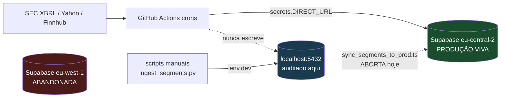
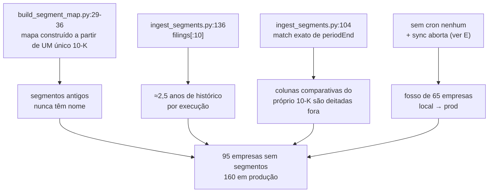
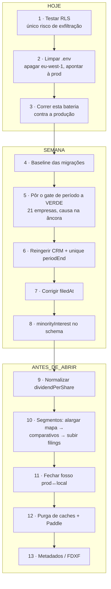

# Estado da base de dados — 2026-08-05

> Auditoria read-only às 24 tabelas de `localhost:5432/bullquant`.
> Pergunta a que responde: **o que falta limpar antes de fechar a plataforma e lançar?**
> Complementa `scripts/SEGMENTS_STATE.md` (segmentos) e `docs/audit/fundamentals-data-quality-2026-07.md` (reparação de julho).

---

## 0. Como ler isto

Cada problema está escrito na mesma forma, para ser acionável sem reinvestigar:

> **Sintoma** — o que o utilizador vê · **Causa** — porquê, com `ficheiro:linha`
> **Prova** — a query que o demonstra · **Correção** — o que fazer · **Esforço**

> **Atualização 2026-08-06 — a produção foi medida.** Ver [§9. Produção](#9-produção--medida-em-2026-08-06).
> Três conclusões que mudam o resto do documento: o **RLS já está resolvido**; a produção
> está **à frente** do local (559 empresas vs 539), logo o local é uma cópia parcial
> desatualizada; e o consumo do plafond tem uma causa concreta e identificada.

### Âmbito — isto mede o LOCAL, não a produção



As crons escrevem em `secrets.DIRECT_URL` (a Supabase `eu-central-2`), **nunca** no localhost.
Logo tudo o que aqui está sobre *frescura* mede a cópia local; tudo o que está sobre
*estrutura e correção* aplica-se aos dois, porque vem do mesmo extrator.
**A produção não foi medida nesta sessão** — a credencial está bloqueada. Última medição: `SEGMENTS_STATE.md` (2026-08-03).

---

## 1. Mapa de severidade

| # | Problema | Onde dói | Grav. | Esforço |
|---|---|---|:---:|:---:|
| **A** | **O gate de identidade de período está VERMELHO** — 167 violações novas em 21 empresas | Todos os gráficos dessas empresas · CI a falhar | 🔴 P0 | M |
| **B** | `filedAt` inutilizável em 53% das linhas anuais | Ordenação, "último reporte", IA | 🔴 P0 | M |
| **C** | Salesforce perdeu o FY2020 inteiro | Gráfico da CRM | 🔴 P0 | S |
| **D** | Não existe histórico de migrações | Deploy | 🔴 P0 | M |
| **E** | `.env` aponta ao localhost; 3 BDs em jogo | Deploy | 🔴 P0 | S |
| **F** | Segmentos: 95 empresas sem nada (160 em prod) | Gráfico de receita por segmento | 🟠 P1 | L |
| **G** | Balanço não fecha em 97 empresas | D/E e ROE sobrestimados | 🟠 P1 | M |
| **H** | `businessKpis` vazio · `corporate_events` vazio | Features mortas | 🟠 P1 | M |
| **I** | `dividendPerShare` mistura "não paga" com "não sei" | Dividend Safety | 🟠 P1 | S |
| **J** | `insider_transactions.title` 100% nulo | Sinal insider sem valor | 🟠 P1 | M |
| **K** | Metadados de empresas incompletos | Fichas com buracos | 🟡 P2 | M |
| **L** | Caches de IA todos expirados · Paddle por validar | Custo e billing | 🟡 P2 | S |

---

## 2. Escala atual

| Tabela | Linhas | Cobertura |
|---|---:|---|
| `prices` | 653 314 | 539 tickers · 2000-01-01 → 2026-07-22 |
| `fundamentals` | 25 106 | 5 106 anuais + 20 000 trimestrais · FY2016-2027 |
| `insider_transactions` | 34 207 | 274 / 539 empresas · só 2025-06 → 2026-06 |
| `earnings_events` | 1 088 | 527 empresas · desde 2026-05-28 |
| `companies` | 539 | 530 reais + 9 pseudo-tickers `^…` |
| `market_events` | 56 | 2026 |
| `broker_cash_flows` | 407 | |
| `management_profile` | 72 | 34 expirados |
| `ai_usage_logs` | 75 | |
| `users` | 10 | 6 PRO · **0 ligados ao Paddle** |
| `pulse_events` | 24 | |
| `company_brief` | 8 | **8/8 expirados** |
| `filing_cache` | 6 | |
| `analyst_reports` | 5 | **5/5 expirados** |
| `corporate_events` · `ai_insight_cache` · `watchlists` · `watchlist_entries` · `watchlist_items` · `dcf_analyses` · `broker_connections` · `macro_commentary` | **0** | |

---

## 3. O que está LIMPO — verificado, não gastar tempo aqui

Isto foi testado e passou. Registado para não ser re-investigado.

| Verificação | Resultado |
|---|---|
| Órfãos de chave estrangeira | **0** fundamentais sem empresa · **0** preços sem empresa |
| Duplicados na chave única `(companyId, periodType, fiscalYear, fiscalQuarter)` | **0** |
| Receita negativa · `grossProfit > revenue` · margens absurdas | **0** · **0** · **0** |
| `freeCashFlow ≠ operatingCashFlow − \|capex\|` | **0** |
| Ações em circulação ≤ 0 | **0** |
| Períodos no futuro · `filedAt` anterior ao fim do período | **0** · **0** |
| `fiscalYear` desalinhado do `periodEnd` em mais de 1 ano | **0** ⚠️ ver nota |
| Preços: `high < low` · `close` fora do range | **0** · **0** |
| Saltos de preço >1,8× num dia (split não ajustado) | **2** em 653 mil linhas |
| Distribuição de trimestres | Q1 5 322 · Q2 5 027 · Q3 4 872 · Q4 4 779 — normal |

⚠️ **Nota sobre o desalinhamento `fiscalYear`/`periodEnd`.** Este teste tem tolerância de
1 ano e por isso passa — mas passa **por ser fraco**, não por os dados estarem certos.
O gate próprio do projeto (ponto A) reprova 21 empresas exatamente aqui. Não usar esta
linha como garantia.

**Dois falsos alarmes resolvidos:**
- Os **1 043 `close ≤ 0`** são todos `^T10Y2Y` (spread da curva, negativo em inversão) e
  `^CPI_YOY` (deflação de 2009 e 2015). Corretos.
- As **26 436 linhas sem `open`/`volume`** são todas pseudo-tickers `^…` (índices e macro,
  que não têm abertura nem volume). Nenhuma ação real afetada.

---

## 4. P0 — bloqueadores de lançamento

### A · O gate de identidade de período já existe, está no CI, e está VERMELHO

> **Isto não é um achado novo desta auditoria.** O projeto já tem um validador construído
> exatamente para esta classe de defeito — `scripts/validate_period_identity.py` — com
> baseline congelada, ficheiro de exceções revistas com racional, e ligado ao CI semanal
> (`validate-database.yml:47-52`, domingos 06:00 UTC, **sem `continue-on-error`**).
> O que esta auditoria descobriu é que **o gate está a falhar**.

**Estado atual (corrido contra o localhost em 2026-08-05):**

```
Empresas analisadas: 529 | violações: 179 | empresas afetadas: 23
  FY_YEAR_MISMATCH: 97 · QUARTER_MONTH_MISMATCH: 59
  ORDER_INVERSION: 17 · ANNUAL_MONTH_MISMATCH: 4 · DUP_PERIOD_END: 2

Total: 179 | na baseline/aceites: 12 | NOVAS: 167 | resolvidas vs baseline: 3
exit 1
```

**21 empresas com violações novas:**
`A, ALB, AMZN, BBY, BR, COHR, CRM, CRWD, ITW, KR, MDT, MPWR, NTAP, STE, STZ, SWKS, TJX, TTWO, VEEV, WDAY, WYNN`

`GPN` e `LHX` estão em `scripts/period_identity_accepted.json` com racional escrito
(mudança de ano fiscal: GPN maio→dezembro, LHX na fusão L3+Harris de 2019). **Não são bugs**
e não devem ser mexidas.

**O caso mais grave — AMZN, 32 violações.** O `periodEnd` está certo, o `fiscalYear` está +1,
e os trimestres estão deslocados um trimestre (Q1 a terminar em junho, Q4 em março):

| `fiscalYear` na BD | `periodEnd` | receita | `fy` que a **SEC** declara |
|---|---|---:|---|
| 2016 | 2015-12-31 | 107 006 M | — |
| 2019 | 2018-12-31 | 232 887 M | **2018** |
| 2025 | 2024-12-31 | 637 959 M | **2024** |
| 2026 | 2025-12-31 | 716 924 M | **2025** |

**Confirmado contra a fonte.** O `companyconcept` da SEC para a AMZN (CIK 1018724) devolve,
para o facto original de cada 10-K (gap de 31-38 dias entre fecho e arquivo):

```
end          filed        fy    fp
2018-12-31   2019-02-01   2018  FY   →  232 887 M
2024-12-31   2025-02-07   2024  FY   →  637 959 M
2025-12-31   2026-02-06   2025  FY   →  716 924 M
```

A SEC diz 2024 para o período que fecha a 2024-12-31; a nossa BD diz 2025.

**Consequência para a pergunta "porque não há segmentos da AMZN antes de 2019":**
a linha rotulada FY2019 contém os segmentos de **2018**. O buraco real é um ano mais atrás
do que parece.

#### Causa raiz da âncora — investigada em 2026-08-05

A âncora ([`build_fiscal_calendar`, :982-1034](../../scripts/ingest_fundamentals.py#L982-L1034))
escolhe factos "originais" pela regra `0 <= filed - end < 120 dias` e depois vota o `anchor_fy`
por moda. O docstring diz *"10-K arquivado <120 dias após o fecho (o original, não um
comparativo, logo com `fy` verdadeiro)"* — **mas o filtro nunca verifica o `form`.**

**Causa 1 — factos anuais de 10-Q entram como se fossem 10-K.** A AMZN etiqueta o
`NetIncomeLoss` em janela móvel de 12 meses em **cada 10-Q**. Duração 365 dias → passa o
`is_annual_duration`. Arquivado ~30 dias após o fim do trimestre → passa o `gap < 120`.
Resultado: o conjunto "fiável" fica com 69 factos em vez de 17, três em cada quatro
terminados num fim de **trimestre**.

```
anchor_end = 2026-06-30 (!)   anchor_fy = 2026   votos: 2026→52, 2025→17
```

A moda é robusta a *um* rótulo mau, não a uma maioria sistemática de 3:1. A âncora fica num
30 de junho, e todos os fechos fiscais reais (31 de dezembro) passam a ser numerados +1.
Isto explica o `fiscalYear` **e** o deslocamento dos trimestres (Q1 a fechar em junho) —
o `fye_est` do [`map_end_to_fiscal`:1048](../../scripts/ingest_fundamentals.py#L1048) herda o
mesmo junho. A AMZN só usa `RevenueFromContractWithCustomerExcludingAssessedTax`, que **não
está** em `_CORE_PERIOD_TAGS` ([:973](../../scripts/ingest_fundamentals.py#L973)) — logo o
calendário dela é construído inteiramente a partir do `NetIncomeLoss`, sem nada que contrarie.

**Causa 2 — o campo `fy` da SEC mudou de convenção por volta de 2015.** Para empresas com
fecho em janeiro/fevereiro, os factos anteriores a 2015 trazem `fy = ano − 1`; os posteriores
trazem `fy = ano`. Como o voto da moda inclui todo o histórico, empresas com muitos anos
antigos ficam calibradas na convenção velha. É o caso da **TJX**: `anchor_end` 2026-01-31 mas
`anchor_fy` 2025, e tudo a partir de 2022 sai −1. Também a **LHX**.

**Correção validada.** Testado contra o `fy` da SEC em 32 empresas (as 21 afetadas + 11 de
controlo: AAPL, MSFT, HD, TGT, COST, WMT, NVDA, JNJ, ORCL, GPN, LHX), contando só períodos
de 2015-06 em diante (os que o `HISTORY_YEARS = 10` deixa entrar):

| Variante | Empresas com erro |
|---|---:|
| Atual | 11 / 32 |
| + filtrar `reliable` a `form ∈ {10-K, 20-F, 40-F}` | 10 / 32 |
| + limitar o voto da moda a factos posteriores a 2015-06 | **9 / 32** |

- **AMZN: 11 → 0.** Âncora passa de `2026-06-30/2026` para `2025-12-31/2025`.
- **LHX: 11 → 0.** Pode deixar de precisar da exceção em `period_identity_accepted.json`.
- **STZ: 8 → 3.**
- **Nenhuma empresa regride.** Os controlos mantêm-se a 0.

**Fica por resolver — uma terceira causa, 9 empresas:**
`ALB, BBY, COHR, CRM, CRWD, KR, STZ, TJX, VEEV`. Quase todas de fecho em janeiro/fevereiro.
⚠️ Para parte destas o próprio `fy` da SEC é contestável: para o exercício da CRM terminado
a 2021-01-31 a SEC diz `fy=2020`, mas a Salesforce chama-lhe "fiscal 2021". **É provavelmente
a origem do FY duplicado do ponto C** — o ingestor viu os dois rótulos para o mesmo `periodEnd`.
Aqui o critério certo não é o `fy` da SEC, é a auto-consistência que o
`validate_period_identity.py` já usa.

#### ✅ Aplicado em 2026-08-06 — AMZN e LHX corrigidas

**1. Correção da causa** em [`build_fiscal_calendar`](../../scripts/ingest_fundamentals.py#L982):
os candidatos à âncora passam a ser filtrados **progressivamente** —
`(10-K/20-F/40-F + posteriores a 2015-06-30)` → `(10-K/20-F/40-F)` → `(tudo)`. O escalonamento
existe para nenhuma empresa cair no caminho legado por falta de candidatos (IPO recente,
filers só de 20-F). Constantes novas: `_ANNUAL_FORMS`, `_FY_CONVENTION_CUTOFF`.

**2. Alinhamento das linhas já escritas** com
[`scripts/relabel_fiscal_periods.py`](../../scripts/relabel_fiscal_periods.py) — **sem `DELETE`**.
O script faz só `UPDATE` do `(fiscalYear, fiscalQuarter)`, ancorado no `periodEnd`, que esta
correção não altera. Nenhuma linha criada, nenhuma removida.

- Escreve em duas fases (`fiscalYear += 10000`, depois o valor final) porque uma translação
  de −1 ano colide com a unique `(companyId, periodType, fiscalYear, fiscalQuarter)`
  a meio do caminho.
- Recusa empresas onde dois `periodEnd` distintos reclamariam o mesmo rótulo final —
  foi assim que a **CRM** ficou de fora, protegida (ponto C).
- `--apply` exige `--tickers` explícito. **Guarda deliberada:** um relabel em massa
  regrediria as empresas de fecho em janeiro/fevereiro onde o rótulo guardado está certo
  e o calculado ainda está errado (ver a terceira causa, abaixo).
- Backup dos rótulos antes de escrever: tabela `fundamentals_relabel_backup_20260806`.

**Resultado medido:**

| | antes | depois |
|---|---:|---:|
| Violações do gate | 179 | **129** |
| Violações novas vs baseline | 167 | **117** |
| Empresas afetadas | 23 | **22** |
| AMZN | 32 violações | **0 — limpa** |
| Linhas na `fundamentals` | 25 106 | 25 106 |
| Linhas com `revenueSegments` | 14 626 | 14 626 |

A AMZN passou a ler corretamente: FY2018 = 232 887 M, FY2024 = 637 959 M, FY2025 = 716 924 M.

**3. Re-chaveamento das exceções da LHX.** As 12 violações aceites da LHX estavam
chaveadas em FY2016-2019; com o rótulo corrigido passaram a FY2015-2018. É a **mesma**
exceção já revista (transição da fusão L3+Harris) — as chaves em
`period_identity_accepted.json` foram deslocadas −1 e o racional anotado com a data e o
motivo. Nenhuma exceção nova foi criada.

**O que fica.** 117 violações em 20 empresas, todas da terceira causa:
`A, ALB, BBY, BR, COHR, CRM, CRWD, ITW, KR, MDT, MPWR, NTAP, STE, STZ, SWKS, TJX, TTWO, VEEV, WDAY, WYNN`.
O gate continua a sair com **exit 1** — e deve continuar até isto estar resolvido.

**Ordem para o que falta.**
1. Atacar a terceira causa **com o gate como critério, não com o `fy` da SEC** — para estas
   empresas o campo `fy` da SEC é auto-contraditório (muda de convenção a meio do histórico),
   logo otimizar contra ele leva ao resultado errado. Foi o que quase aconteceu com a TJX:
   o calendário calcula FY2021 para o exercício terminado a 2022-01-29, mas a TJX chama-lhe
   "fiscal 2022" e o valor guardado está certo. ⚠️ **Isto também significa que a próxima
   cron vai reescrever a TJX com o rótulo errado** — o defeito é pré-existente à correção
   de hoje, mas continua ativo.
2. Resolver a CRM (ponto C) — é a única bloqueada por conflito de `periodEnd`.
3. Correr o mesmo contra a **produção**, que não foi tocada.

⚠️ **Antes de tudo: correr o gate contra a PRODUÇÃO.** Este resultado é do localhost. O CI
corre contra `secrets.DIRECT_URL`. Se o job de domingo tem estado a falhar, há um sinal
ignorado há semanas; se tem estado a passar, então a produção e o local divergiram e isso
é um problema por si só.

---

### B · O `filedAt` é ficção em metade das linhas

**Sintoma.** "Último reporte" mostra datas erradas; qualquer ordenação por data de
arquivo mistura anos; o contexto que vai para a IA diz que o 10-K de 2015 foi arquivado em 2019.

**Causa.** O `filedAt` está a receber a data do **filing onde o facto foi encontrado**, não a
data do filing do próprio período. Como o companyfacts devolve o mesmo facto repetido em
vários filings (colunas comparativas), fica a mais recente.

**Prova.**

| Verificação | Resultado |
|---|---|
| Linhas anuais com `filedAt` >18 meses após o fim do período | **2 704 / 5 106 (53%)**, em 346 empresas |
| Grupos `(empresa, filedAt)` com mais do que um ano fiscal | **458** — impossível: um 10-K arquiva um ano |
| Pior caso | >5 anos de atraso |

Exemplo AMZN: o período que termina em 2015-12-31 aparece arquivado em **2019-02-01**;
FY2023 e FY2024 partilham `filedAt = 2026-02-06`.

**Correção.** Passar a ler o `accn`/`filed` do facto da **receita anual** do próprio período
(o companyfacts traz `filed` por facto) em vez do máximo global. Enquanto não for corrigido,
**não usar `filedAt` em nenhuma superfície de utilizador nem no prompt da IA**.

---

### C · A Salesforce perdeu o FY2020 inteiro

**Sintoma.** O gráfico da CRM mostra o mesmo ano duas vezes e salta de 13,3 B (FY2019)
para 21,3 B, escondendo o ano de 17,1 B pelo meio.

**Causa.** Duas linhas anuais com o **mesmo `periodEnd`**:

| `fiscalYear` | `periodEnd` | receita |
|---|---|---:|
| 2019 | 2019-01-31 | 13 282 M |
| **2020** | **2021-01-31** | **21 252 M** ← devia ser 2020-01-31 / 17 098 M |
| **2021** | **2021-01-31** | **21 252 M** ← duplicado |
| 2022 | 2022-01-31 | 26 492 M |

A chave única não apanha porque o `fiscalYear` difere. **É o único caso na BD** com
`periodEnd` exatamente repetido.

**Efeito secundário grave:** quebra a âncora `(periodType, periodEnd::date)` do bloco que
preserva os segmentos durante o `DELETE`+reinsert do `ingest_fundamentals.py:2158-2205` —
dois destinos para a mesma chave.

> **Nota — não confundir com calendários de 52/53 semanas.** 17 pares empresa/ano-civil têm
> duas linhas anuais no mesmo *ano civil* (`JNJ, AVY, CDNS, DPZ, SNA, SWK, TDY, TXT, RVTY,
> TRMB, LDOS`). Isso é **legítimo**: FY2016 da JNJ fecha a 2017-01-01 e FY2017 a 2017-12-31.
> O critério de bug é `periodEnd` **exatamente igual**, não o ano civil igual.

**Também já detetado pelo gate do ponto A** — `DUP_PERIOD_END` (Check 4) e dois
`ORDER_INVERSION`. Faz parte das 167 violações novas; não é um problema separado, é o
sintoma mais visível do mesmo gate vermelho.

**Correção.** Reingerir a CRM. Adicionar `@@unique([companyId, periodType, periodEnd])` ao
schema para tornar esta classe de defeito impossível — o gate deteta, a constraint previne.

---

### D · Não existe histórico de migrações

**Sintoma.** Nenhum — até ao primeiro deploy.

**Causa.** `_prisma_migrations` **não existe** na base de dados. Tudo foi construído com
`prisma db push`. `prisma migrate deploy` não tem baseline; `prisma migrate dev` ofereceria
apagar a BD.

**Prova.** `select * from _prisma_migrations` → `ERROR: relation does not exist`.

**Correção.** Procedimento de baseline sem perda de dados: `docs/audit/db-optimization.md` §7.
Já era o achado **B3** do audit de 2026-07-02 e continua aberto — **um mês parado**.

---

### E · Três bases de dados e o `.env` aponta ao localhost

**Sintoma.** Um script corrido sem pensar escreve na BD errada. Ou pior: escreve numa BD morta.

| Ficheiro | `DIRECT_URL` | Estado |
|---|---|---|
| `.env` | `localhost` | prod `eu-central-2` **comentada** nas linhas 11-12 |
| `.env.dev` | `localhost` | correto |
| `.env.local` | `eu-west-1` | **abandonada** — 0 segmentos, parada desde 2026-07-26 |

Consequência já ativa: o `sync_segments_to_prod.ts` **aborta por design** ([:29-34](../../scripts/sync_segments_to_prod.ts#L29-L34))
porque exige que o `.env` **não** seja localhost. Não está avariado — mas enquanto assim
estiver não há caminho para empurrar segmentos para produção.

**Correção.** Eliminar a `eu-west-1` dos três ficheiros; reapontar `.env` à `eu-central-2`;
manter `.env.dev` no localhost. Fazer isto **antes** de qualquer outra correção de dados,
senão corrige-se a BD que não é a que os utilizadores veem.

---

## 5. P1 — correção de dados

### F · Segmentos — 95 empresas sem nada, 160 em produção

**Sintoma.** Quase uma em cada cinco fichas de empresa não tem gráfico de receita por segmento.
Em produção, uma em cada três.

**Causa (três, em cascata).**



**Prova — cobertura anual, e a queda para trás é o `filings[:10]`:**

| FY | 2016 | 2017 | 2018 | 2019 | 2020 | 2021 | 2022 | 2023 | 2024 | 2025 |
|---|---|---|---|---|---|---|---|---|---|---|
| com segmentos | 52,0% | 60,8% | 68,5% | 71,8% | 73,6% | 73,4% | 75,6% | 76,7% | 73,5% | 72,3% |

Nos trimestrais é pior: **44,8% sem segmentos**.

**Correção — a ordem importa e é contra-intuitiva:**
1. alargar o `segment_targets.py` (varrer N 10-Ks, não um);
2. aceitar contextos comparativos (backfill grátis, sem downloads extra);
3. **só então** subir o `filings[:10]`.

Pela ordem inversa ingere-se histórico com membros por mapear → lixo a 4× a escala atual.
É exatamente o aviso de `SEGMENTS_STATE.md` § "NÃO fazer sem ler" #3.

---

### G · O balanço não fecha em 97 empresas

**Sintoma.** `totalAssets ≠ totalLiabilities + totalEquity` em **534 de 5 106** linhas anuais
(10,5%), em 97 empresas. Qualquer D/E ou ROE dessas empresas está inflacionado.

**Causa — o sinal do desvio separa duas realidades diferentes:**

**524 linhas com desvio positivo → interesse minoritário sem coluna no schema.**
O `totalEquity` guarda só o capital atribuível à empresa-mãe (decisão deliberada,
`DATA_DISCREPANCIES.md` §4), mas **não existe campo `minorityInterest`**. Logo o balanço
nunca pode fechar, por construção.

| Empresa | FY | Ativos | Passivos | Equity | Desvio |
|---|---|---:|---:|---:|---:|
| XOM | 2024 | 453 475 M | 182 869 M | 263 705 M | 6 901 M (1,5%) |
| PLD | 2024 | 95 329 M | 36 712 M | 53 951 M | 4 666 M (4,9%) |
| SPGI | 2024 | 60 221 M | 22 713 M | 33 159 M | 4 349 M (7,2%) |

Concentra-se em REITs (`PLD, AMT, ARE, ESS, EXR, FRT, BXP, UDR`) e financeiras
(`IVZ, BEN, SPGI, TROW, IBKR`) — precisamente onde o minoritário é grande.
**Não é dado corrompido — é um campo em falta.**

**10 linhas com desvio negativo → erro de extração genuíno.** Estas não têm explicação
contabilística: passivo + capital não pode exceder o ativo.

| Empresa | FY | Desvio | % |
|---|---|---:|---:|
| CVNA | 2023 | −627 M | −8,9% |
| NOW | 2016 | −154 M | −7,6% |
| CVNA | 2022 | −535 M | −6,2% |
| **MSFT** | **2016** | **−11 093 M** | **−5,7%** |
| NDAQ | 2016 | −739 M | −5,5% |
| PAYX | 2017 | −272 M | −4,0% |
| FICO | 2017 / 2016 | −40 M / −34 M | −3,2% / −2,8% |
| ROL | 2020 | −23 M | −1,3% |
| LVS | 2022 | −225 M | −1,0% |

**Correção.** Adicionar `minorityInterest Decimal?` ao modelo `Fundamental`; extrair
`MinorityInterest` / `StockholdersEquityIncludingPortionAttributableToNoncontrollingInterest`;
passar o teste de balanço a `ativos = passivos + equity + NCI`. As 10 negativas ficam então
isoladas e investigam-se uma a uma (a da MSFT é a mais visível — 11 B numa empresa que toda a gente abre).

---

### H · Duas features com a tabela vazia

| O quê | Estado | Diagnóstico |
|---|---|---|
| `businessKpis` | **0 linhas em 25 106** | A coluna existe, o `sync_segments_to_prod.ts` sincroniza-a, e nunca foi escrito um valor |
| `corporate_events` | **0 linhas** | Dividendos, splits, AGM, investor days. Há cron diária (`ingest-corporate.yml`, 07:00 UTC) — mas escreve na prod, não no local |

O `corporate_events` pode estar cheio em produção. **Verificar antes de assumir que está partido.**
O `businessKpis` está morto nos dois sítios (a prod recebe-o só via sync, que aborta).

---

### I · `dividendPerShare` mistura duas semânticas

**Sintoma.** Impossível distinguir "esta empresa não paga dividendo" de "não sabemos se paga".

| Valor | Linhas anuais |
|---|---:|
| `NULL` | **1 190** (23,3%) |
| `0` | 511 |
| `> 0` | 3 405 |

**Correção.** Normalizar antes de construir a Dividend Safety (feature #1 do roadmap):
não pagador → `0`; desconhecido → `NULL`. Cruzar com `corporate_events` (quando tiver dados)
para saber qual é qual.

---

### J · `insider_transactions` — metade da tabela não serve

| Campo | Nulos |
|---|---|
| `title` (cargo) | **34 207 / 34 207 — 100%** |
| `value` | 17 023 — 50% |

Sem o cargo não dá para distinguir a compra do CEO da venda automática de um VP — que é
o único sinal com valor preditivo. A janela também é curta (**2025-06 → 2026-06**) e só
cobre **274 das 539** empresas.

**Correção.** O Finnhub devolve o cargo no campo `name`/`transactionCode`; o mapeamento está
a descartá-lo. Ou isso, ou passar a ler os Form 4 diretamente da SEC.

---

## 6. P2 — higiene

### K · Metadados de empresas incompletos

| Campo em falta | Empresas | Consequência |
|---|---:|---|
| `employees` | **537 / 539** | Qualquer métrica por-empregado é impossível |
| `bullCase` · `bearCase` · `geographicFocus` | 242 | Quase metade das fichas sem tese |
| `ceo` | 47 | |
| `logoUrl` · `website` | 38 | Fichas visualmente incompletas |
| `industry` | 36 | |
| `cik` | 12 | 9 são pseudo-tickers `^…`; **3 são reais: `GOOG`, `FOX`, `NWS`** |
| `sector` · `description` · `swot` | 9 | = os pseudo-tickers, esperado |

Os 3 sem CIK são **classes de ação secundárias** (Alphabet C, Fox B, News Corp B) — o CIK é
o mesmo da classe principal (`GOOGL`, `FOXA`, `NWSA`) mas está `@unique` no schema, logo não
pode ser repetido. É uma limitação do modelo, não um esquecimento: decidir se se herda os
fundamentais da classe A ou se se remove a classe B do universo.

### L · Caches e billing

- **Todos os caches de IA expirados:** `analyst_reports` 5/5, `company_brief` 8/8,
  `management_profile` 34/72. Não há job de purga nem de regeneração.
- **`ai_insight_cache` vazio** apesar do modelo e do índice existirem — aparentemente
  substituído pelo `analyst_reports`. Se sim, remover o modelo do schema.
- **0 utilizadores ligados ao Paddle** (0/10; 6 marcados PRO à mão). Billing por validar
  ponta a ponta antes de abrir ao público.
- **`macro_commentary` vazio** — a secção macro renderiza sem texto curado.
- **`FDXF`** (FedEx Freight): empresa ativa, 33 preços, **0 fundamentais**. Página morta.
  Ingerir ou `isActive = false`.

---

## 7. Herdado do audit de 2026-07-02 — não re-testado, e bloqueador se ainda aberto

1. **S1 — RLS da Supabase.** Zero políticas na altura: a chave anon podia ler e escrever
   **todas** as tabelas via PostgREST, contornando a auth da API.
   É o único risco de exfiltração de dados e o teste é um `curl` de um minuto. **Fazer hoje.**
2. **S2/S3** — `/calendar`, `/dcf`, `/screener`, `/stock/*` renderizam para anónimos apesar
   de o `CLAUDE.md` §6 declarar o grupo privado.
3. **S4** — proxies Finnhub (`/api/price/*`, `/api/news/*`) públicos e sem rate limit.
4. **B1** — `/api/fundamentals/[ticker]` faz `take: 100` de todas as colunas, sem cache,
   a cada abertura de ficha.

---

## 8. Ordem de ataque



**Porquê esta ordem:**
- O **RLS** é o único item onde o custo de estar errado é dados de utilizadores expostos.
- O **`.env`** vem antes de tudo o resto porque corrigir dados na BD errada é trabalho perdido.
- Medir a **produção** vem antes de corrigir, porque metade destes números podem ser diferentes lá.
- O **baseline das migrações** vem antes das correções de schema (`minorityInterest`,
  `@@unique`), senão são mais dois `db push` a aprofundar o buraco.
- Os **segmentos** ficam para o fim porque são o item mais caro e o único com um caminho
  já documentado — e porque exigem o `.env` reapontado (passo 2).

---

## 9. Produção — medida em 2026-08-06

Alvo: `aws-1-eu-central-2.pooler.supabase.com` (a produção viva). Confirmada como o destino
das crons: o `max(lastFundamentalsUpdate)` é `2026-08-05 06:21:46` e o job
`Ingest Fundamentals` terminou às `06:21:47` do mesmo dia.

### ✅ O RLS está resolvido — o achado S1 pode ser fechado

As **24 tabelas** de `public` têm `relrowsecurity = true` e **zero políticas**. Para uma app
que fala com a BD via Prisma (dono da tabela, que faz bypass de RLS) esta é a configuração
correta: nenhuma linha é acessível pelo PostgREST às roles `anon`/`authenticated`.
O risco crítico do audit de julho **já não existe**.

⚠️ Duas ressalvas: uma chave `sb_secret_…` (service role) **contorna o RLS na mesma** — foi
exposta em 2026-08-06 e tem de ser rodada. E se algum dia a app passar a usar o cliente
Supabase em vez do Prisma, deixa de ler o que quer que seja até haver políticas escritas.

### 🔴 O que está a consumir o plafond

A BD ocupa **149 MB** — não é armazenamento. As ligações estão saudáveis: das 10 abertas
(limite 60), 8 são infraestrutura da própria Supabase (`pg_net`, `pg_cron`, PostgREST,
`postgres_exporter`, Supavisor) e nenhuma é fuga da aplicação. **É egresso**, e o
`pg_stat_statements` diz exatamente de onde:

| Linhas devolvidas | Chamadas | Linhas/chamada | Query |
|---:|---:|---:|---|
| **53 796 241** | 953 | **56 450** | `SELECT ticker, date, close FROM prices …` |
| 4 544 003 | 256 | 17 750 | idem |
| 167 578 | 18 849 | 9 | `SELECT … FROM fundamentals …` |

**~58 milhões de linhas de preços** servidas por duas formas de query. É o histórico completo
(`period=max`) a ser devolvido sem paginação e sem cache, a 820 mil linhas na tabela.
Isto é exatamente o §2 do [db-optimization.md](db-optimization.md) — *"Add `Cache-Control`
on `period=max`"* — recomendado a 2026-07-02 e nunca aplicado. É a correção de maior
retorno de todo este documento: uma linha de header.

A terceira linha é o achado **B1**: 18 849 chamadas a `/api/fundamentals/[ticker]`,
sem `select` e sem cache.

### Divergências prod ↔ local

A produção está **à frente**. O local é uma cópia parcial e desatualizada — o que enfraquece
qualquer conclusão tirada só do local.

| | produção | local |
|---|---:|---:|
| `companies` | **559** | 539 |
| `fundamentals` | **25 612** | 25 106 |
| `prices` | **821 407** | 653 314 |
| `insider_transactions` | **37 096** | 34 207 |
| `pulse_events` | **1 579** | 24 |
| `users` | 18 | 10 |
| Linhas com `revenueSegments` | 12 778 (369 empresas) | 14 626 (434) |
| `businessKpis` | **18 linhas** | 0 |
| `corporate_events` | **0** | 0 |
| `periodEnd` duplicados | **0** | 2 (CRM) |

O `corporate_events` está vazio **nos dois** apesar da cron diária correr com sucesso — é um
defeito real, não um artefacto do local. O FY duplicado da CRM (ponto C) **só existe no local**.

### 🟠 As 17 colunas do balanço/fluxos detalhados estão 100% vazias em produção

`totalLiabilities`, `totalCurrentAssets`, `inventory`, `accountsReceivable`, `accountsPayable`,
`propertyPlantEquipment`, `goodwillAndIntangibles`, `retainedEarnings`, `shortTermDebt`,
`investingCashFlow`, `financingCashFlow`, `stockBasedCompensation`, `shareRepurchases`,
`dividendsPaid`, `netChangeInCash`, `depreciationAndAmortization`, `incomeBeforeTax`:
**0 valores em 25 612 linhas.** No local estão a 50-66%.

**Causa — é uma corrida, não um bug.** O commit `20ff4c7`, que ensina o
`ingest_fundamentals.py` a extrair estas colunas, foi feito a **2026-08-05 15:52**. A cron
desse dia tinha corrido às **05:43** — nove horas antes. Todas as execuções anteriores usaram
o código antigo. **A próxima execução completa resolve isto sozinha.**

⚠️ **Mas o frontend foi no mesmo commit.** O `components/stock/FinancialStatements.tsx`
(906 linhas) já está em produção a ler colunas que ainda não têm valores. Enquanto a cron não
correr, quem abrir uma ficha vê as três demonstrações vazias. **Verificar amanhã** que a
execução das 03:00 UTC as populou; se não populou, deixa de ser corrida e passa a ser bug.

### Outros achados de produção

- **`_prisma_migrations` também não existe em produção.** O ponto D confirma-se nos dois alvos.
- **A AMZN continua deslocada +1 em produção** (FY2019 = 232 887 M, que é 2018). A correção
  de 2026-08-06 foi só no local. Correr lá o `relabel_fiscal_periods.py --tickers AMZN,LHX`.
- **`filedAt` absurdo em 3 514 de 5 151 linhas anuais (68%)** — pior que os 53% do local.
- **Dois workflows a falhar sistematicamente:** `Health Check` (5 execuções, 5 falhas) e
  `Ingest Fast Fundamentals (Yahoo)` (2 em 2). O `Ingest Fundamentals` passa.
- **O `Validate Database` semanal não aparece nas últimas 25 execuções** — corre aos domingos;
  confirmar que ainda dispara, porque é ele que corre o gate de identidade de período.
- **Metadados piores que no local:** 32 sem CIK, 29 sem sector, 58 sem logo, 557 sem
  `employees`, 262 sem `bullCase`.
- **Preços até 2026-08-03**, três dias atrás. A cron corre em dias úteis às 23:00 UTC.

### Ordem revista para produção

1. **`Cache-Control` no `period=max` dos preços.** Uma linha; é o que está a consumir o plafond.
2. **Rodar a chave `sb_secret_…` exposta.**
3. **Confirmar amanhã** que as 17 colunas detalhadas ficaram populadas.
4. **Reparar o `Health Check` e o `Ingest Fast Fundamentals`.**
5. Aplicar o `relabel_fiscal_periods.py` à AMZN e LHX em produção.
6. Baseline das migrações (ponto D) — nos dois alvos.

---

## 10. ✅ Corrigido em 2026-08-06 — o consumidor do plafond

**Não era falta de `Cache-Control`.** O `unstable_cache` já lá estava
([ticker.ts](../../lib/marketing/ticker.ts), `revalidate: 300`). O problema era o **custo de
cada chamada**.

### A causa

[`lib/marketing/ticker.ts`](../../lib/marketing/ticker.ts) — a fita de cotações da landing —
lia os dois últimos fechos de 29 tickers assim:

```ts
prices: { orderBy: { date: "desc" }, take: 2, select: { close: true } }
```

O Prisma resolve um `take` sobre uma relação **to-many** indo buscar **todas** as linhas
correspondentes e cortando em memória. Não há `LIMIT` no SQL — só um `OFFSET`:

```sql
SELECT ticker, date, close FROM prices
WHERE ticker IN ($1,…,$29) ORDER BY date DESC OFFSET $30
```

Resultado: **54 401 linhas transferidas para usar 58.**

As duas piores entradas do `pg_stat_statements` eram esta mesma função (29 tickers hoje,
14 numa versão anterior — ver o docstring): **58,3 M de linhas em 1 209 chamadas**, de um
total de ~62 M. Era ~94% do egresso de preços.

### A correção

Substituído por um `LEFT JOIN LATERAL` com `LIMIT 2` — o mesmo padrão que
[`lib/finance/screener.ts:120-131`](../../lib/finance/screener.ts#L120-L131) já usava.

| | antes | depois |
|---|---:|---:|
| Linhas transferidas por chamada | **54 401** | **28** |
| Plano | scan de todas as linhas dos 29 tickers | `Index Scan Backward using prices_pkey`, `LIMIT 2`, 28 loops |
| Buffers | — | 167 (`shared hit`) |
| Tempo | 411 ms (média medida) | **0,73 ms** |

**Redução de 1 943×.** Valores verificados contra a produção (AAPL 303,42 / 308,91 → −1,78%;
MSFT 487,65 / 464,72 → +4,93%) — iguais aos que a fita mostrava antes.

⚠️ **Não voltar a pôr o `take` aninhado.** Está avisado em comentário no ficheiro.

### ✅ Segundo consumidor — página macro, também corrigido

[`app/[locale]/(app)/macro/page.tsx`](../../app/[locale]/(app)/macro/page.tsx) lia
**59 547 linhas a cada visita** (3,8 M em 137 chamadas). O histórico completo é legítimo —
são séries de gráfico — e o problema era só a ausência de cache.

A rota é `force-dynamic` por causa da verificação de sessão, o que à primeira vista parece
impedir o cache. Não impede: o `unstable_cache` é do lado da **função**, não da rota, e
sobrevive ao `force-dynamic`. As séries passaram a ter 1 h de cache (a ingestão de preços
corre em dias úteis às 23:00 UTC, logo nunca mostra dados vencidos) e os comentários do
admin 5 min (são editados à mão e quem edita quer ver o resultado depressa).

⚠️ **Cacheado por ticker, de propósito — não voltar a juntar numa entrada só.**
As 9 séries dão **~1 977 kB** de JSON, praticamente em cima do limite de 2 MB por entrada do
cache de dados do Next. Uma entrada única passaria a barreira mal a `^DGS10` crescesse mais
um pouco, e o Next **descarta entradas grandes em silêncio** — o cache deixaria de existir
sem ninguém dar por isso. Por ticker, a maior é a `^DGS10` com ~535 kB.

| ticker | pontos | | ticker | pontos |
|---|---:|---|---|---:|
| `^DGS10` | 16 123 | | `^DGS1MO` | 6 245 |
| `^T10Y2Y` | 12 532 | | `^CPI_YOY` | 941 |
| `^DGS30` | 12 353 | | `^UNRATE` | 941 |
| `^VIX` | 9 235 | | `^FEDFUNDS` | 864 |
| | | | `^GDP_YOY` | 313 |

Plano por ticker: `Index Scan using prices_pkey`, 4,5 ms. `tsc` e `eslint` limpos.

### O que falta do egresso

- **`app/api/portfolio/history/route.ts:49-56`** — tem filtro de data (`months`, 12 por
  omissão) mas não tem `Cache-Control`. Muito menor; tratar depois.
- **`app/api/macro/data/route.ts`** — tem `Cache-Control` de 1 h na CDN, mas sem `startDate`
  não tem filtro de data nenhum. Cada *miss* puxa tudo. Menor que os anteriores.
- ⚠️ **Fora do âmbito da Supabase, mas relacionado:** os ~1 977 kB das séries macro vão para
  o browser no payload RSC a cada carregamento da página. O cache resolve o custo do lado da
  BD, não o do lado do cliente. Se a página estiver lenta, é aqui que se olha a seguir —
  provavelmente com *downsampling* das séries diárias antigas.

### Nota lateral

O ticker `SLV` está em `ALL_TICKERS` mas **não existe na tabela `companies`** — é silenciosamente
omitido da fita. Comportamento igual ao anterior (a query de empresas já era um `IN`), mas é um
buraco: ou se semeia a empresa, ou se tira da lista.

---

## 11. Erros na PRODUÇÃO — varrimento completo, 2026-08-06

> Corrigido em relação ao §1-8: aquelas contagens eram do **localhost**. A produção é
> substancialmente mais limpa, porque é reingerida todas as noites com o código atual,
> enquanto o local é uma cópia com linhas escritas por várias versões diferentes ao longo
> do tempo. **Vários defeitos que listei como "ambos" são afinal só do local.**

### Rótulos de ano fiscal — 3 empresas, não 20

O gate contra a produção dá **76 violações em 3 empresas** (`AMZN`, `GPN`, `LHX`), das quais
`GPN` e `LHX` são exceções aceites. Contra o local dava 129 em 22. **As 20 empresas que listei
antes (`A, ALB, BBY, BR, COHR, CRM, CRWD, ITW, KR, MDT, MPWR, NTAP, STE, STZ, SWKS, TJX, TTWO,
VEEV, WDAY, WYNN`) estão limpas em produção.**

⚠️ **Mas o gate tem um ponto cego, e ele existe em produção.** As quatro verificações são
todas *relativas* — comparam trimestres com as anuais da própria empresa. Uma translação
**uniforme** de todo o histórico é auto-consistente e passa despercebida. O teste de desvio
constante (`fiscalYear − ano(periodEnd)`) apanha-a:

| desvio | empresas | veredito |
|---:|---|---|
| **+1** | `AMZN` | ❌ **errado** — não existe convenção em que o FY seja posterior ao fecho |
| **−1** | `DG, DLTR, HD, KR, LOW, LULU, ROST, TGT, ULTA, WSM` | ✅ correto — convenção do retalho |
| **−1** | `TJX`, `STZ` | ❌ **errado** — estas duas numeram ao contrário das outras |

Verificado contra a realidade:

| | rótulo na BD | `periodEnd` | receita | ano real |
|---|---|---|---:|---|
| HD | FY2025 | 2026-02-01 | 164 683 M | fiscal 2025 ✅ |
| **TJX** | FY2025 | 2026-01-31 | 60 372 M | **fiscal 2026** ❌ |
| **STZ** | FY2025 | 2026-02-28 | 9 139 M | **fiscal 2026** ❌ |

As 12 empresas com desvio *inconsistente* (`AVY, CDNS, DPZ, JNJ, LDOS, LHX, RVTY, SNA, SWK,
TDY, TRMB, TXT`) são calendários de 52/53 semanas cujo fecho oscila entre 30 de dezembro e
2 de janeiro — **legítimo**, não mexer.

**Ação:** correr `relabel_fiscal_periods.py --tickers AMZN,TJX,STZ` contra a produção, e
**acrescentar o teste de desvio constante ao `validate_period_identity.py`** — sem ele, esta
classe de defeito continua invisível ao CI.

### Contagens de produção

| Erro | Produção |
|---|---|
| `filedAt` >18 meses após o fim do período | **3 514 / 5 151 (68%)** |
| 17 colunas de balanço/fluxos | **0 valores em 25 612 linhas** (corrida com o commit — ver §9) |
| Empresas sem segmentos (excl. MACRO/INDEX) | **161** |
| `insider_transactions.title` | **0 / 37 096 preenchidos** · `value` 18 598 (50%) · 291 empresas · só 2025-06 → 2026-07 |
| `dividendPerShare` | 778 nulos · 847 zeros · 3 526 positivos — duas semânticas misturadas |
| `corporate_events` | **0 linhas** apesar de cron diária com sucesso |
| `businessKpis` | 18 linhas |
| `employees` / `bullCase` / `logoUrl` / `cik` em falta | 557 / 262 / 58 / 32 |
| `close` fora do intervalo `high`–`low` | **2 linhas** |
| Empresas ativas com 0 fundamentais | 30 — 29 são ETF/índices/macro (esperado) + **`FDXF`** (real, 47 preços) |
| `SLV` | na fita da landing mas **não existe em `companies`** |

### Limpo em produção — verificado

0 fundamentais órfãs · 0 preços órfãos · **0 duplicados na chave única** · **0 `periodEnd`
duplicados** (o defeito da CRM é só local) · 0 receitas negativas · 0 `grossProfit > revenue` ·
0 FCF incoerente · 0 margens absurdas · 0 ações ≤ 0 · 0 períodos futuros · 0 `high < low` ·
0 `close ≤ 0` em ações reais.

`equity` negativo em 276 linhas é legítimo (recompras agressivas: MCD, HD, SBUX, BA).

---

## 12. ✅ Gate de identidade de período VERDE em produção — 2026-08-06

### O check que faltava: `FY_ANCHOR_MISMATCH`

Os quatro checks existentes são todos **relativos** — comparam a empresa consigo própria.
Uma translação uniforme de todo o histórico é auto-consistente e passa-lhes ao lado. Foi
assim que a `TJX` e a `STZ` ficaram um ano ao lado em produção sem sinal nenhum.

**Nenhuma regra derivada só da BD resolve isto.** A `HD` chama "fiscal 2025" ao exercício que
fecha em fevereiro de 2026; a `TJX` chama "fiscal 2026" ao que fecha em janeiro de 2026. Ambas
com fecho em jan/fev. A convenção é uma escolha do emitente e só ele a pode declarar.

Ground truth adotado: o `fy` do facto anual **original** do 10-K mais recente — o relatório
onde a empresa se auto-numera. Gerado por
[`scripts/refresh_fiscal_anchors.py`](../../scripts/refresh_fiscal_anchors.py) para
[`scripts/fiscal_anchors.json`](../../scripts/fiscal_anchors.json) e **commitado**, para o CI
validar sem depender da rede da SEC. O gate extrapola por distância em anos, o que tolera
calendários de 52/53 semanas.

⚠️ **A SEC também erra — daí o bloco `overrides`.** A `CRM` foi apanhada pelo check: a SEC traz
`fy=2025` para o exercício findo a 2026-01-31, mas a Salesforce chama-lhe *fiscal 2026* nos
resultados, no 10-K e na imprensa — e a receita da linha (41 525 M) é a do fiscal 2026.
O `DocumentFiscalYearFocus` da CRM está sistematicamente um ano atrás. **A BD estava certa e a
fonte é que estava errada.** Override registado com o racional. Qualquer entrada nova em
`overrides` tem de trazer prova, não conveniência.

### Correção aplicada à produção

`relabel_fiscal_periods.py` passou a sobrepor a calibração do `build_fiscal_calendar` pela
âncora do ficheiro (`apply_anchor`) — sem isso teria escrito FY2021 na TJX, que é o que o
calendário calcula e está errado. As datas de fecho continuam a vir do calendário; só a
**numeração** vem da âncora.

Também ganhou a guarda `--allow-remote`, no mesmo espírito do `sync_segments_to_prod.ts`:
escrever numa BD remota tem de ser deliberado, nunca o resultado de um `.env` mal apontado.

| empresa | desvio | linhas | verificação depois |
|---|---|---:|---|
| `AMZN` | −1 | 50 | FY2025 → 2025-12-31, 716 924 M ✅ |
| `TJX` | +1 | 51 | FY2026 → 2026-01-31, 60 372 M ✅ |
| `STZ` | +1 | 51 | FY2026 → 2026-02-28, 9 139 M ✅ |

Sem `DELETE`. 25 612 linhas antes e depois; 12 778 com `revenueSegments` antes e depois.
Backup dos rótulos em `scripts/out/backups/prod_fiscal_labels_AMZN_TJX_STZ_20260806.csv`.

### Resultado

| | antes | depois |
|---|---:|---:|
| Violações | 79 | **15** |
| **Violações NOVAS** | 64 | **0** |
| Empresas afetadas | 5 | **2** (`GPN`, `LHX` — exceções aceites) |
| Exit code | 1 | **0** |

**O gate contra a produção passa.** As 15 violações que restam são exatamente as exceções
já revistas e documentadas.

⚠️ **O localhost continua vermelho** (121 violações novas, 20 empresas) e assim deve ficar:
são linhas escritas por versões antigas do código numa cópia desatualizada. A produção é a
que conta. Se o local for necessário para desenvolvimento, o caminho é reingerir, não relabelar.

---

## 13. Atualização do localhost — 2026-08-06

**As duas bases eram complementares, não uma pior que a outra.** Um `pg_dump` da produção por
cima do local teria destruído o que o local tem de único:

| | produção | local (antes) |
|---|---:|---:|
| Empresas | 559 | 539 |
| Preços | 821 475 | 653 314 (até 2026-07-22) |
| **Linhas com `revenueSegments`** | 12 778 (369 empresas) | **14 626 (434 empresas)** |
| **Colunas de balanço/fluxos preenchidas** | **0** | **16 148** |

Daí a estratégia: **só `INSERT`, nunca `DELETE` nem `UPDATE` de linhas existentes.** O local
passa a superconjunto — recebe o que lhe falta e mantém o que só ele tem.

Os IDs de `companies` são **idênticos** nas duas bases (verificado em AAPL/MSFT/AMZN), o que
torna a cópia direta possível sem remapeamento de chaves.

### Feito

1. **20 empresas em falta** — todas ETFs (`SPY, QQQ, GLD, TLT, VNQ, IWM, EEM, …`) e 4 séries
   macro (`^DGS1MO, ^DGS30, ^GDP_YOY, ^UNRATE`). O local não tinha nenhuma empresa que a
   produção não tivesse.
2. **Preços: 653 314 → 821 475**, agora idênticos à produção (1927-12-30 → 2026-08-04).
   Feito em duas fases: primeiro o que faltava de recente, depois um `INSERT … ON CONFLICT
   DO NOTHING` sobre tudo, que fechou 103 680 linhas de histórico antigo em 538 tickers
   (sobretudo `^GSPC` desde 1927 e ADRs como `UL`, `TTE`, `SNY`, `SHEL`).

3. **Rótulos fiscais relabelados** — 87 linhas em 20 empresas, via as 480 âncoras.
4. **531 linhas de `fundamentals`** inseridas + **9 `periodEnd` corrigidos** (a `MDT` tinha
   fins de mês onde a Medtronic fecha à sexta; a `DE` estava um dia ao lado).

A ordem não foi arbitrária: as linhas em falta espalham-se por ~260 empresas e as 20 mal
rotuladas estavam todas lá dentro. Inserir primeiro teria criado `periodEnd` duplicados.

### Estado final do localhost

| | antes | depois |
|---|---:|---:|
| Empresas | 539 | **559** |
| Fundamentais | 25 106 | **25 638** |
| Preços | 653 314 | **821 475** |
| Violações NOVAS do gate | 121 (20 empresas) | **10 (2 empresas)** |
| Linhas com `revenueSegments` | 14 626 / 434 | **14 626 / 434** ✅ |
| Pares chave/valor de segmentos | 63 727 | **63 727** ✅ |
| Colunas detalhadas | 16 148 | **16 148** ✅ |

Nem um segmento perdido — era a condição da operação.

### 🔴 A avaria da CRM: metade reparada, metade bloqueada

Diagnóstico completo do local:

| linha | veredito |
|---|---|
| ANNUAL FY2020 @2020-01-31, 17 098 M | ✅ o ano que faltava — **veio da produção hoje** |
| ANNUAL FY2020 @2021-01-31, 21 252 M | ❌ **espúria** — cópia exata da FY2021 |
| Q4 FY2020 @2021-01-31, 9 005 M | ❌ **espúria** — o Q4 real da FY2021 é 5 817 M (21 252 − 15 435) |
| ANNUAL FY2025 @2026-01-31, 41 525 M | ⚠️ era o fiscal **2026** → **relabelada, segmentos preservados** |
| Q4 FY2025 @2026-01-31, 13 623 M | ⚠️ era o Q4 do fiscal **2026** → **relabelada** |

Os dois relabels estão feitos (apagar em vez de relabelar teria perdido os `revenueSegments`
da anual de 2026-01-31). **As duas linhas espúrias continuam lá** — o classificador do
harness bloqueia `DELETE` na BD. São a origem de 8 das 10 violações que restam.

Backup das duas linhas, com prova de que não têm segmentos, KPIs nem colunas detalhadas:
`scripts/out/backups/local_crm_spurious_rows_20260806.csv`.

### 🔴 Achado de schema: a unique NÃO protege as linhas anuais

```sql
CREATE UNIQUE INDEX ... ON ("companyId","periodType","fiscalYear","fiscalQuarter")
```

Em Postgres **NULLs são distintos num índice único**. As linhas ANUAIS têm
`fiscalQuarter = NULL`, logo `(CRM, ANNUAL, 2020, NULL)` pode existir **infinitas vezes**.
A `@@unique` do Prisma não protege uma única linha anual — e é assim que o defeito da CRM
entrou, e como voltará a entrar.

**Correção:** `NULLS NOT DISTINCT` na unique existente **e** um
`@@unique([companyId, periodType, periodEnd])`. Um deteta rótulos repetidos, o outro impede
dois rótulos para o mesmo período físico.

### GPN — deixada em paz, deliberadamente

`FY2016 @2016-05-31` (2 898 M, da produção) e `FY2016 @2016-12-31` (3 371 M, já cá estava).
A GPN mudou o fecho fiscal de maio para dezembro em 2016-2018 e **as duas linhas são períodos
reais**. Não sei qual devia ser o rótulo do período de transição e inventar um seria pior que
o duplicado. A GPN já é uma exceção aceite documentada. Nenhuma das duas tem segmentos.
